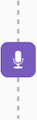
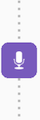
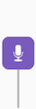

# Timeline View


[](https://android-arsenal.com/api?level=21)
[](https://jitpack.io/#anacoimbrag/timeline-view)
[](https://codecov.io/gh/anacoimbrag/timeline-view)

Android view for timeline purpose. Ideally made for bank statement or sequential data, for example. 


## Usage

For a working implementation, please take a look at the [sample](https://github.com/anacoimbrag/timeline-view/tree/master/sample)

1. Include library
```groovy
// project/build.gradle
allprojects {
    repositories {
        maven { url "https://jitpack.io" }
    }
}
```

```groovy
// app/build.gradle
dependencies {
    implementation "com.github.anacoimbrag:timeline-view:$latest_version"
}
```
Latest version is [](https://jitpack.io/#anacoimbrag/timeline-view)

### Add to your layout

It is very easy to use this lib, you just need to add `<Timeline>` tag in your XML layout or instantiate in your code using the default constructor `Timeline(context)`.

```xml
<com.anacoimbra.android.timeline.Timeline
    android:layout_width="wrap_content"
    android:layout_height="100dp"
    app:bulletIcon="@drawable/ic_expense"
    app:bulletType="round"
    app:linePadding="4dp" />
```

#### Timeline Attributes

| Attribute | Type | Default |
| --- |---| :---: |
| `bulletIcon`        | drawable          | -       |
| `bulletIconTint`    | color             | -       |
| `bulletSize`        | dimension         | `30dp`  |
| `bulletIconPadding` | dimension         | `4dp`   |
| `bulletCornerRadius`<sup>1</sup> | dimension         | `6dp`   | 
| `bulletBackground`  | color \| drawable |  `#7E57C2`  | 
| `bulletType`        | BulletType        | `round` |
| `bulletSize`        | BulletGravity     | `center`|
| `lineWidth`         | dimension         | `2dp`   |
| `lineColor`         | color             |  `#B9B9B9`  | 
| `linePadding`       | dimension         | `0dp`   |
| `lineDashSize`<sup>2</sup>      | dimension         | `4dp`   |
| `lineDashGap`<sup>3</sup>       | dimension         | `4dp`   |
| `lineType`          | LineType          | `solid` |
| `lineVisibility`    | LineVisibility    | `both`  |

**BulletType**

| Code | XML | |
| --- |---| --- |
| `BulletType.ICON`   | `icon`   | 
| `BulletType.SQUARE` | `square` | 
| `BulletType.CIRCLE` | `circle` | 
| `BulletType.ROUND`  | `round`  | 

**BulletGravity**

| Code | XML | |
| --- |---| --- |
| `BulletGravity.TOP`   | `top`   | 
| `BulletGravity.CENTER` | `center` | 
| `BulletGravity.BOTTOM` | `bottom` | 

**LineType**

| Code | XML | |
| --- |---| --- |
| `LineType.SOLID`  | `solid`  | 
| `LineType.DASHED` | `dashed` | 
| `LineType.DOTTED` | `dotted` | 

**LineVisibility**

| Code | XML | |
| --- |---| --- |
| `LineVisibility.BOTH`   | `both`   | 
| `LineVisibility.TOP` | `top` | 
| `LineVisibility.BOTTOM` | `bottom` | 
| `LineVisibility.NONE`  | `none`  | 

<sup>1 • Only works with BulletType `round`</sup>
<sup>2 • Only works with LineType `dashed`</sup>
<sup>3 • Only works with LineType `dashed` or `dotted`</sup>